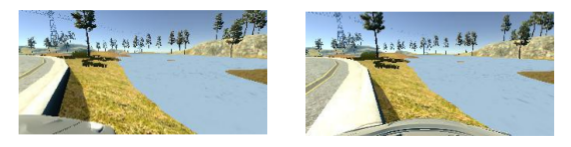
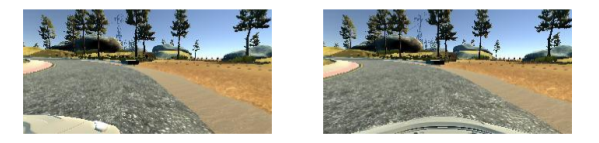
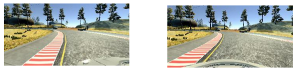

## Behavior Cloning Project

The chosen model worked with the example input LeNet structure with additional layers added per the Nvidia driving model in the referenced paper. (see code for references) This followed a basic CNN design, with the images normalized and processed consistently for input; connected convolutional layers of increasing geometric size are used to capture the convolutional features and signatures of interest; these are generalized by two fully connected layers and then passed to an output layer to make the appropriate prediction set for driving steering angle input.

The strategy that was proposed to follow was to train the network in providing the correct responses to drive the car back to the center of the lane; the goal being to maintain the track without going off. The training set must provide sufficient input to generate corrections that scale back to the center of the road.

Over fitting was reduced by using a large amount of dropout in the fully connected layers and less in the convolutional size; the thought being that the features in the track are relatively constant – the edges, in this case, of the driving surface – so fitting those well would be a good idea, and then dropping out the first generalization layer to a higher degree so that the specific response to the set

### Architecture and Training Documentation
Experimenting on the model; the initial approach was to use data collected specifically to evoke a given response (steering one way, or drifting, then correcting to the center of the road). This is the approach suggested in the video modules; however; the input mechanisms be they keyboard or mouse led to binary input – large corrections applied over a short period of time. This did not generalize well and was backed up by my mentor and the forum discussions. In the interest of maintaining timelines for the course, it was suggested that the sample data could meet requirements. This was verified by me [here](https://discussions.udacity.com/t/performance-with-sample-data/364068/6)

I concluded that the model was over fitting straight lines; the predictions from the model did not have sufficient magnitude to deal with sharp turns. I removed approximately 1000 images manually from the sample data set based on long runs of straight line data (20-30+) that I felt contributed little to the model per my theory above. I left shorter corrections (10-20 images) around the center point so the model could learn how to maintain a straight track; as predicted, this did work, but does lead to the model “hunting” around the center point of the track.

This was unexpected; once a good dataset was generated, large changes to the model including the size of the convolution layers, or the number, did not have a major impact on the performance. This clearly demonstrated the importance of having good data to generalize from.

As the image training set is randomized, differences in performance were noticed between runs on the images. This is likely do to the size of the input data and the particular batching sizes. Additional data may minimize this effect.

### Simulation Results
The car was able to successfully navigate with a fair amount of confidence the required course. The model was run overnight to see if random perturbations would cause the model to ultimately crash; this was the case with some early attempts. The models trained on the modified sample set data ran for a 6 hour period without issues on the required track.

As insufficient data was available to generalize on the optional track, this was not attempted.

Per the nVidia model and the form discussions, the Keras ELU() activation was selected over the previously dominant ReLU(); the selection of this activation function (exponential linear function over rectified linear) was primarily on the basis of the referenced experience. Exponential linear unit activation functions specifically are designed to provide a more rapid training as the mean activation value is zero. Both models were experimented with; ELU() provided a track that was closer to the center, but the dominant factor of the activation functions was the quality of the input data as discussed above. ELU minimized loss more quickly than ReLU() with good results in as few as 20 epochs. Smooth transitions from edge cases back to center are absolutely critical to successfully navigating the course.

For purposes of the submission, as documented above, ONLY the sample data was used. Attempts to generate data did not give good results as my driving skills proved to be unworthy of a training model. This is not to say that observing the model, and biasing the set did not occur! Per the reviewer's request, I have illustrated the primary problems with sample data and the steps taken to correct them.

Problem 1: Car going for a swim

The first attempt at the model clearly indicated the model did not correct quickly enough;
on the first turn requiring corrective input of more than a fractional degree, the curb was
hit and then the car went in the lake. Not good!

Problem 2: Hard turn crash

Correction/augmentation solution: Bias to more input!
The operating theory was that the large amount of data with little steering input in the
sample set was providing a learning bias against a rapid correction; this led the network to
not “see” far enough ahead and make corrections in advance; once the cameras were
sufficiently off track that there was not enough data in the set to guide them back on,
their behavior was essentially random, an the car would drive directly into this post.

Biasing the input to pay more attention when the car was correcting to the left (more
steering angle input) put additional weights on these factors during training. On the test
run, the car is still a little late to correct, but does so proportionately to speed.
In modifying drive.py, with the modified dataset, the network was able to successfully
navigate the course at full speed.
